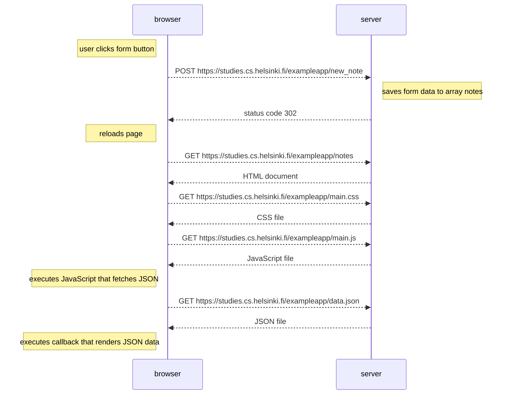

```mermaid
  sequenceDiagram
    participant browser
    participant server

  Note left of browser: user clicks form button
  browser-->>server: POST https://studies.cs.helsinki.fi/exampleapp/new_note
  Note right of server: saves form data to array notes
  server-->>browser: status code 302
  Note left of browser: reloads page
  browser-->>server: GET https://studies.cs.helsinki.fi/exampleapp/notes
  server-->>browser: HTML document
  browser-->>server: GET https://studies.cs.helsinki.fi/exampleapp/main.css
  server-->>browser: CSS file
  browser-->>server: GET https://studies.cs.helsinki.fi/exampleapp/main.js
  server-->>browser: JavaScript file
  Note left of browser: executes JavaScript that fetches JSON
  browser-->>server: GET https://studies.cs.helsinki.fi/exampleapp/data.json
  server-->>browser: JSON file
  Note left of browser: executes callback that renders JSON data
```
